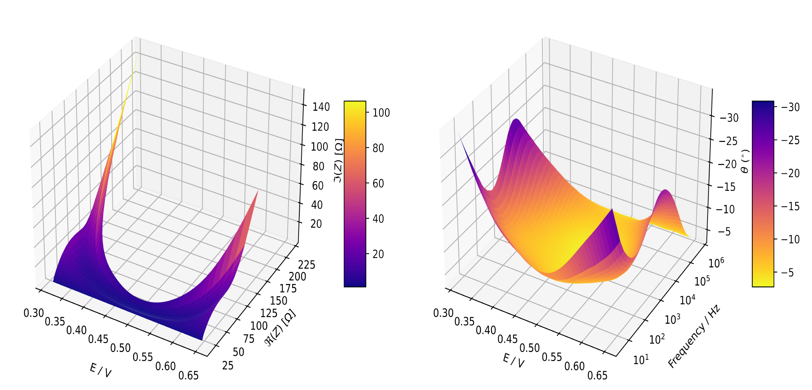

.. pymultipleis documentation master file, created by
   sphinx-quickstart on Fri Sep 23 20:33:04 2022.
   You can adapt this file completely to your liking, but it should at least
   contain the root `toctree` directive.

pymultipleis
=============
.. code-block:: bash

   "Simplicity is the ultimate sophistication - Leonardo da Vinci"

:code:`pymultipleis` offers a robust approach to fitting a sequence of electrochemical impedance spectra with some model function.
Usually the spectra being fitted are gradually varying or similar to each other and were obtained as a result of continuous change
in the property of the electrochemical system under study. Such properties include but are not limited to temperature, potential,
state of charge and depth of discharge.

The fitting algorithm implemented in pymultieis allows the kinetic parameters of the system
such as the charge transfer resistance, double layer capacitance and Warburg coefficient to be obtained
as curves which vary as a function of the dependent variable under study

The ``py`` in ``pymultipleis`` represents python while the ``multipleis`` is an abbreviation for ``Multiple Electrochemical Impedance Spectra``.

:code:`pymultipleis` offers methods modules for model fitting, model validation, visualization.

An paper which introduces the algorithm implemented in ``pymultipleis`` can be found `here <https://doi.org/10.1002/elan.201600260>`_.
How :code:`pymultipleis` works is briefly described in the section :ref:`how-it-works-label`

Installation
------------

.. code-block:: bash

   pip install pymultipleis

pymultipleis requires the following dependencies:

-   Python (>=3.9)
-   jax (>=0.3.17)
-   jaxopt (>=0.5)
-   Matplotlib (>=3.6.0)
-   NumPy (>=1.23.3)
-   Pandas (>=1.4.4)
-   SciPy (>=1.9.1)

Examples and Documentation
---------------------------

:ref:`quick-start-guide-label` contains a detailed guide on getting started with :code:`pymultipleis`.
It is assumed that the user is already familiar with basic python syntax.
Detailed tutorials on several aspects of :code:`pymultipleis` can be found on this `page <https://github.com/richinex/pymultipleis/tree/main/docs/source/examples>`_.

.. toctree::
   :maxdepth: 2
   :caption: Contents:

   quick-start-guide
   pymultipleis
   examples
   simultaneous-vs-sequential-fit
   how-it-works
   troubleshooting
   extra-resources
   FAQ

Indices and tables
==================

* :ref:`genindex`
* :ref:`modindex`
* :ref:`search`
