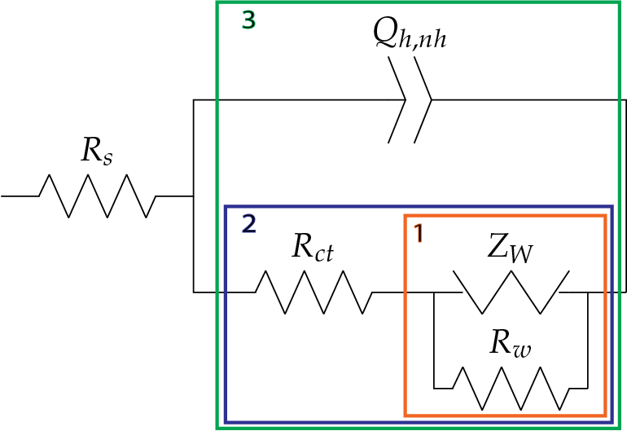
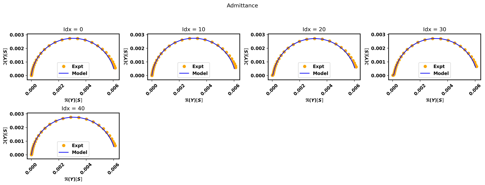
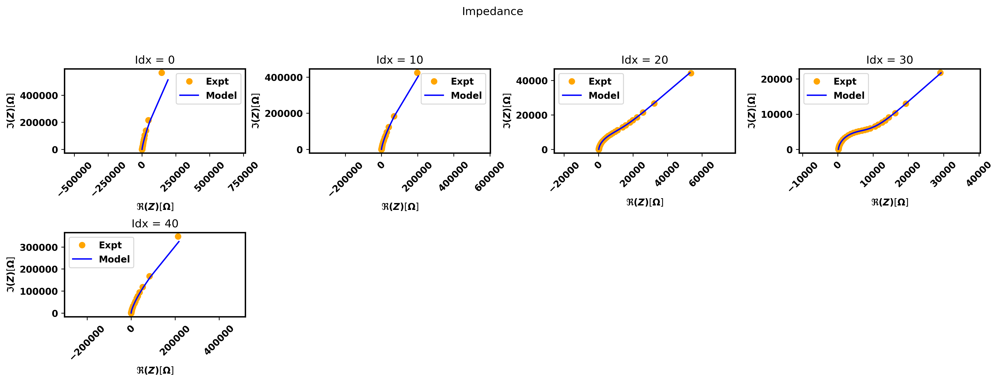
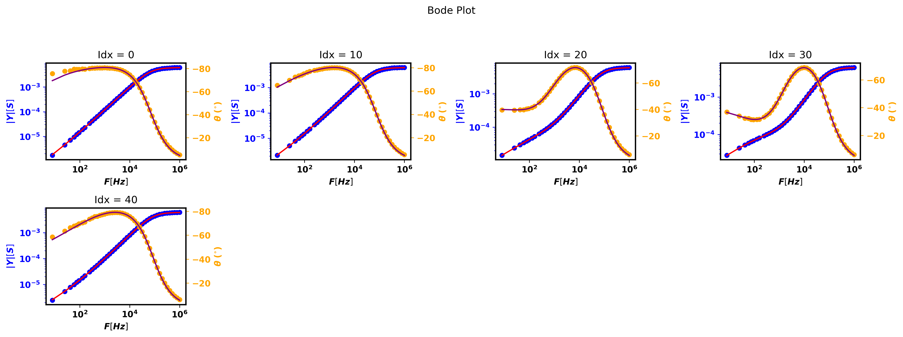
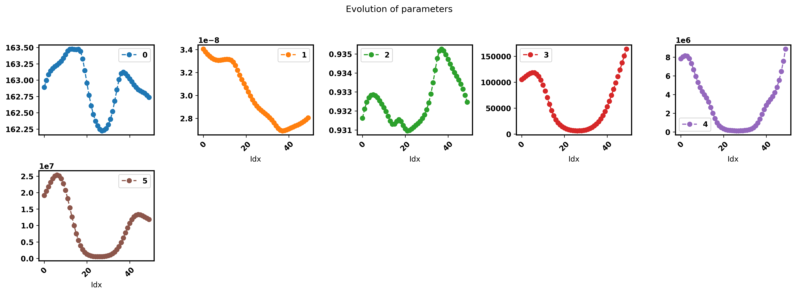
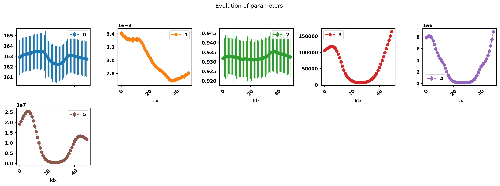

.. _quick-start-guide-label:

=========================================
Getting started with :code:`pymultipleis`
=========================================

:code:`pymultipleis` is a Python package for processing multiple electrochemical impedance spectroscopy (EIS) data.
It uses an object oriented approach and is based on the `JAX library <https://jax.readthedocs.io/en/latest/>`_.
:code:`pymultipleis` provides a Multieis class with methods for fitting, visualizing and saving the results thereafter.

The following steps are good starting points towards analyzing your own data using :code:`pymultipleis`

.. hint::

  Please do not hesistate to `open an issue <https://github.com/richinex/pymultipleis/issues>`_ should you encounter any difficulties or notice any bugs.

Step 1: Installation
====================

:code:`pymultipleis` should be installed via PyPI

.. code-block:: bash

   pip install pymultipleis

Step 2: Load your data
================================

The data that is loaded should be a vector of frequencies at which the immittance data was taken,
and the 2-D array of complex immittances (impedances or admittances) where the size of the rows correspond
to the length of the frequencies vector and the size of the columns is the number of spectra to be fitted.
If we know the standard deviation of our immittance measurements, this can also be used instead of the ``modulus`` or other weighting options.
It is assumed that the frequencies are equal for all the spectra in a particular series.
The frequencies and immittance shall be our freq and Z when we create our Multieis instance.
In the example below the files which were originally stored as numpy arrays
will be converted to JAX Device arrays using :code:`jnp.asarray` function.

We assume that we have our files in the data folder one step above working directory

.. code-block:: python

  import numpy as onp
  import jax.numpy as jnp
  import pymultipleis.multieis as pym

.. testsetup::

  import numpy as onp
  import jax
  import jax.numpy as jnp

.. doctest::
  :pyversion: >= 3.9

  # Load the frequency data
  >>> F = jnp.asarray(onp.load('../data/redox_exp_50/freq_50.npy'))

  # Load a 2-D array of admittances to be fitted
  >>> Y = jnp.asarray(onp.load('../data/redox_exp_50/Y_50.npy'))

  # Load a 2-D array of the standard deviation of the admittances
  # Here we assume we know the standard deviation of our admittances.
  >>> Yerr = jnp.asarray(onp.load('../data/redox_exp_50/sigma_Y_50.npy'))

.. testcode::

  # We can check for the consistency in the shapes of the data we loaded
  print(F.shape)
  print(Y.shape)
  print(Yerr.shape)

.. testoutput::

  (45,)
  (45, 50)
  (45, 50)

.. important::
  :code:`pymultipleis` does not offer a preprocessing module since other packages offer this feature.
  For instance files from different vendors (ZPlot, Gamry, Parstat, Autolab) can be read using the
  `preprocessing module` offered by `impedancepy <https://impedancepy.readthedocs.io/en/latest/preprocessing.html>`_

Step 3: Define your impedance/admittance model
===================================================

Next we define our equivalent circuit/immittance model as a normal python function.
This approach eliminates the need for prebuilt circuit models and offers researchers a far greater flexibility since
any custom immittance function can be fitted to their data.

For instance we shall convert modified *Randles* circuit shown below to a python function which returns the admittance of the circuit.

.. code-block:: python
  :caption: A modified Randles circuit

  def redox(p, f):
      w = 2*jnp.pi*f                # Angular frequency
      s = 1j*w                        # Complex variable
      Rs = p[0]
      Qh = p[1]
      nh = p[2]
      Rct = p[3]
      Wct = p[4]
      Rw = p[5]
      Zw = Wct/jnp.sqrt(w) * (1-1j) # Planar infinite length Warburg impedance
      Ydl = (s**nh)*Qh                # admittance of a CPE
      Z1 = (1/Zw + 1/Rw)**-1
      Z2 = (Rct+Z1)
      Y2 = Z2**-1
      Y3 = (Ydl + Y2)
      Z3 = 1/Y3
      Z = Rs + Z3
      Y = 1/Z
      return jnp.concatenate([Y.real, Y.imag], axis = 0)

An even simpler way would be to predefine a function ``par`` which computes the total impedance of circuit elements in parallel

.. code-block:: python

  par = lambda a, b: 1/(1/a + 1/b) # Defines the total impedance of circuit elements in parallel

  def redox(p, f):
      w = 2*jnp.pi*f                      # Angular frequency
      s = 1j*w                            # Complex variable
      Rs = p[0]
      Qh = p[1]
      nh = p[2]
      Rct = p[3]
      Wct = p[4]
      Rw = p[5]
      Zw = Wct/jnp.sqrt(w) * (1-1j)       # Planar infinite length Warburg impedance
      Zdl = 1/(s**nh*Qh)                  # admittance of a CPE
      Z = Rs + par(Zdl, Rct + par(Zw, Rw))
      Y = 1/Z
      return jnp.concatenate((Y.real, Y.imag), axis = 0)

.. tip::
  The key idea to remember is that for circuit elements in series, we add their impedances while for
  elements in parallel, we add their admittances.

Next, we define an initial guess, bounds and smoothing factor for each of the parameters as JAX device arrays.

.. code-block:: python

  p0 = jnp.asarray([1.6295e+02, 3.0678e-08, 9.3104e-01, 1.1865e+04, 4.7125e+05, 1.3296e+06])

  bounds = [[1e-15,1e15], [1e-8, 1e2], [1e-1,1e0], [1e-15,1e15], [1e-15,1e15], [1e-15,1e15]]

  smf = jnp.asarray([100000.0, 100000.0, 100000.0, 100000.0, 100000.0, 100000.0])

.. note::

   The smoothing factor is a value that determines how smoothly a certain parameter varies as A
   function of the sequence index. The values of the smoothing factor ``smf`` are not fixed. They could vary depending on the
   data and weighting used. Check out the :ref:`examples-label` page for more details.

Step 4: Create an instance of the fitting class
===================================================

An instance our our  multieis class is created by passing it our initial guesses :code:`p0`, frequency :code:`F`, admittance :code:`Z`,
the bounds, :code:`bounds` for each parameter, the smoothing factor (:code:`smf`), the model :code:`redox`, the weight :code:`Yerr`
and the :code:`immittance` we are modeling which in this case is the admittance.

.. code-block:: python

  eis_redox = pym.Multieis(p0, F, Y, bounds, smf, redox, weight= Yerr, immittance='admittance')

.. note::

   The details of the computation of the standard deviation of the admittance used in this guide is given
   in this `paper <https://doi.org/10.1002/celc.202200109>`_.
   Methods for obtaining the standard deviation of impedance measurements are briefly described under the :ref:`FAQ-label` section.

Step 5: Fit the model to data
=======================================

Once our class in instantiated, we fit the data by calling any of the fit methods.
:code:`pymultipleis` offers a :code:`fit_simultaneous()`, :code:`fit_simultaneous_zero()` and a :code:`fit_stochastic()` method.
The :code:`fit_simultaneous()` and :code:`fit_simultaneous_zero()` methods have accept two extra arguments: :code:`method`
which can be any of the methods (TNC, BFGS and L-BFGS-B) and :code:`n_iter`, an integer
which determines the number of iterations used in the minimization. :code:`fit_stochastic()` takes in two arguments,
a learning rate (:code:`lr`) and :code:`num_epochs`, which for most problems,
setting ``learning_rate`` = 1e-3 and ``num_epochs`` = 5e5 is probably sufficient.

.. code-block:: python

  popt, perr, chisqr, chitot, AIC = eis_redox.fit_simultaneous()

Step 6: Visualize the plots
=====================================

In order to make it easy to visualize the plots resulting from the fitting procedure, :code:`pymultipleis` offers three different plotting methods.
We call the :code:`plot_nyquist()` method on the instance we created to view the complex plane plots,
the :code:`plot_bode()` to view the bode plots and the :code:`plot_params()` method to view the parameter plot. Thus we have a total of four generated plots:

* The complex plane plots (Nyquist) - the impedance and the admittance plots are generated. This method can be called before or after a fit.
* The Bode plots - can be called before and after a fit.
* The plot of the optimal parameters - can only be called after a fit.

The :code:`plot_nyquist()` and :code:`plot_bode()` methods take in a :code:`steps` argument which determines
the interval over which the plots are sampled. The default argument for the steps parameter is 1.
A maximum of 20 plots can be shown to avoid cluttering the screen. The :code:`plot_params()` method
has a :code:`show_errorbar` parameter which accepts a boolean. When set to True,
the parameters are plotted with their respective standard deviations shown as errorbars. There is also a labels parameters
which accepts a dictionary as argument. The keys represent the circuit elements while the values are the respective units.

.. code-block:: python

  eis_redox.plot_nyquist(steps = 10)

.. code-block:: python

  eis_redox.plot_bode(steps = 10)

.. code-block:: python

  eis_redox.plot_params()

.. code-block:: python

  eis_redox.plot_params(show_errorbar=True)

Step 7: Save the results
=====================================

In addition, :code:`pymultipleis` provides methods to save the generated plots. The :code:`save_plot_nyquist()` saves the complex plane (Nyquist) plots,
the :code:`save_plot_bode()` saves the Bode plots while the :code:`save_plot_params()` saves the plot of the optimal parameters.
The :code:`save_plot_params()` can only be called after a fit is performed.

.. code-block:: python

  eis_redox.save_plot_nyquist(fname='redox')
  eis_redox.save_plot_bode(fname='redox')
  eis_redox.save_plot_params(fname='redox')

The is also a :code:`save_results()` method which saves the optimal paramaters ``popt``, the standard error of the parameters ``perr``,
the predicted spectra ``Z_pred`` and the metrics associated with the fit i.e. the ``chisquare`` and the Akaike Information Criterion ``AIC``.
The save methods have an ``fname`` parameter which accepts as argument a string representing the name given to the sub-folder within the current working directory
into which plots and results are saved.
If no fname is provided, a default name 'fit' is used. See an example of saving with an ``fname`` below.

.. code-block:: python

  eis_redox.save_results(fname='redox')

.. warning::

     If a value to :code:`fname` is specified by the user, it must be used as a keyword argument and must also be a valid string

.. important::

  |:thumbsup:| Voila! That's it |:thumbsup:|

