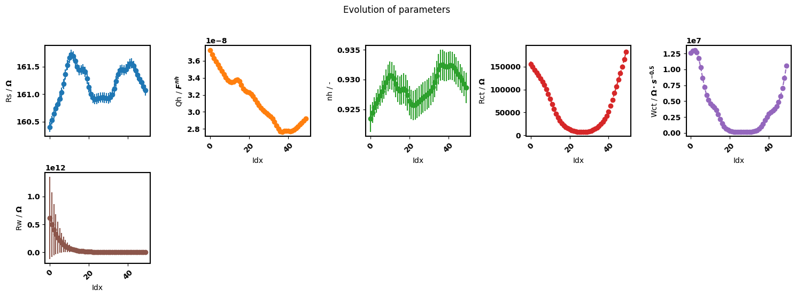
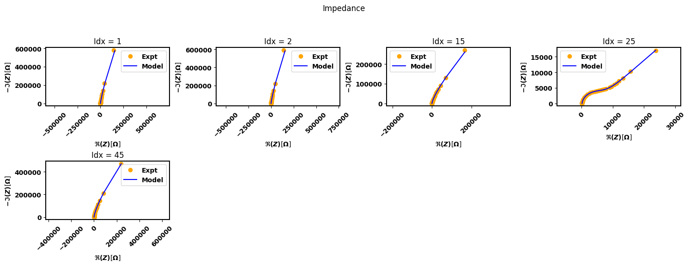

.. _simultaneous-vs-sequential-fit-label:

=========================================
Simultaneous vs sequential fit
=========================================

:code:`pymultipleis` offers a ``fit_sequential()`` method for fitting individual spectra with or without a dependence.
It is based on the regular complex nonlinear least squares and uses the least-squares minimization algorithm
from the `jaxopt API <https://jaxopt.github.io/stable/index.html/>`_ .

1: Preserving correlation between parameters
===================================================

For simpler models, it is possible to observe tendencies of parameter changes using both ``fit_sequential()`` and the ``simultaneous`` fit methods.

a. Nyquist plot
*****************************

.. figure:: _static/seq_all_impedance.png

    A sequential fit on all spectra

.. figure:: _static/simul_impedance.png

    A simultaneous fit

b. Parameter plot
*****************************

    A sequential fit on all spectra

    A batch fit

However as the model becomes more complicated or the spectra noisier, ``fit_sequential()`` becomes more susceptible to jumps in the values of the
parameters loses the ability to preserve the dependence between spectra. This is where the ``fit_simultaneous()`` method becomes essential.
This method preserves the correlation between parameters, is slightly less sensitive to initial values and can be used to obtain a reasonable initial guesses.
Basically, the idea is to initially fit the data with ``fit_simultaneous()`` and then run ``fit_sequential()`` or ``fit_simultaneous_zero()``.
A detailed example can be found in the :ref:`examples-label` page.

.. code-block:: python

  eis_her_sequential = Multieis(p0, F_her, Y_her, bounds, smf_modulus, her, weight= Yerr, immittance='admittance')
  eis_her_sequential.fit_sequential()
  eis_her_sequential.plot_params()

  Sequential fit only

.. code-block:: python

  eis_her_simultaneous = Multieis(p0, F_her, Y_her, bounds, smf_modulus, her, weight= 'modulus', immittance='admittance')
  popt, perr, chisqr, chitot, AIC = eis_her_simultaneous.fit_simultaneous()
  popt, perr, chisqr, chitot, AIC = eis_her_simultaneous.fit_sequential()
  eis_her_simultaneous.plot_params()

  Simultaneous fit followed by sequential fit

2. Fitting a subset of the sequence of data
===================================================

The ``fit_sequential()`` offers a possibility to fit only a subset of the total spectra based on the index of the spectra.

.. code-block:: python

  popt, perr, chisqr, chitot, AIC = eis_redox_sequential.fit_sequential(indices=[1, 2, 15, 25, 45])
  eis_redox_sequential.plot_nyquist()
  eis_redox_sequential.plot_params(show_errorbar = False, labels = labels)

  A sequential fit on selected spectra

  Parameter trend obtained from sequential fit of selected spectra

More examples on using ``fit_sequential()`` can be found in the :ref:`examples-label` page.